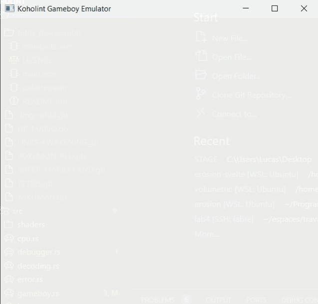

# Koholint Gameboy Emulator



The emulator is currently in development, as a side project to learn about emulation. 
Basic games that do not use any memory bank controllers (e.g. Tetris) are in a somewhat playable state, with graphical bugs and crashes in codepaths I haven't been able to test yet.

Usage :

```
cargo run -- <path to your ROM>
```

You can start a game with the debugger using the `-p` flag, or press `p` at any time to pause the execution and start the debugger.
The available debugger commands can be listed using the `help` command.